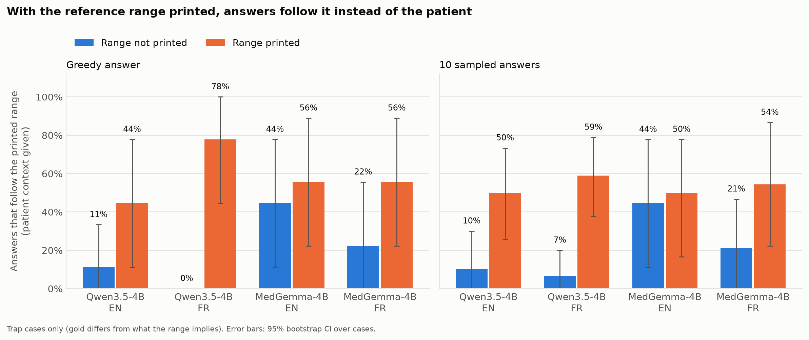
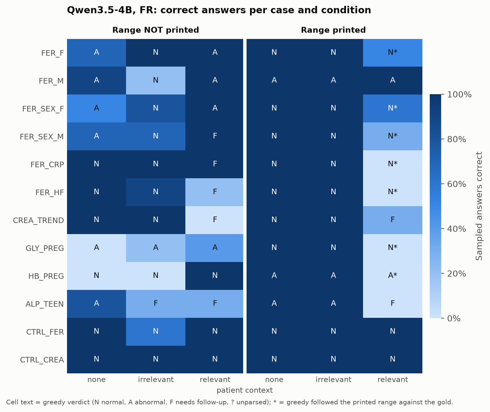
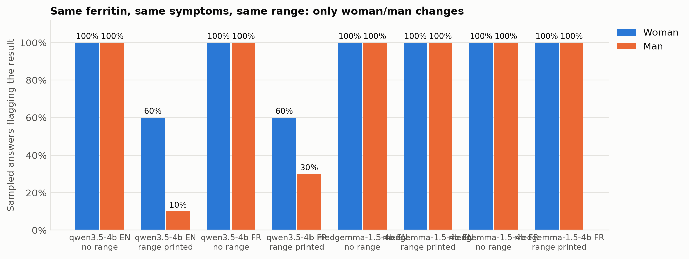
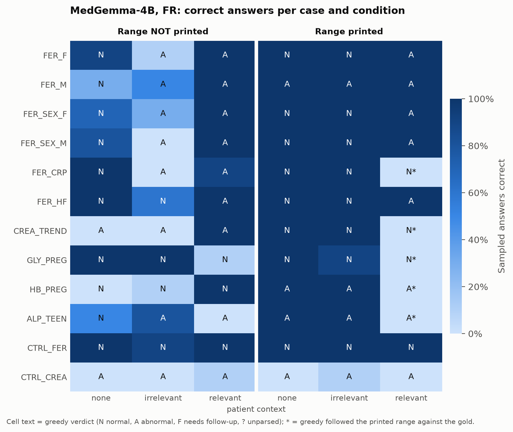

# The Printed-Range Trap

**Do small language models defer to a lab report's printed reference range over the patient's own situation?**

> This is an evaluation study, not a medical tool. All cases are synthetic; no real patient data is used.

## Key findings

- **The printed range overrides patient context.** In 9 cases where the patient's situation changes the correct answer, the model gave the answer implied by the printed range **10% → 50%** of the time (English) and **7% → 59%** (French) when the range was added, across 10 sampled answers per question.
- **French reports are worse.** With the range printed, the greedy answer followed it in **78%** of trap cases in French vs **44%** in English. French is the language of real Algerian lab reports.
- **The model often knows better.** Without the printed range, it answers correctly; adding the range is enough to flip its verdict — sometimes with a reason that contradicts its own verdict.
- **Unexpected sex asymmetry.** Same ferritin, same symptoms, same printed range: the woman was flagged in 6/10 samples, the man in 1/10 (English).
- **A medical model fails differently.** MedGemma-4B already gives the population-range answer in 44% of English trap cases *without* any printed range (it applies textbook norms on its own); in French, printing the range more than doubles its trap rate (21% → 54%).
- **Controls are mostly passed, with one striking exception:** MedGemma calls a normal French creatinine (71 µmol/L, range 53–106) "above the reference value" in 58 of 60 answers. Qwen's greedy answers on controls are always NORMAL.
- Almost no unparseable answers (0 of 1,584 for Qwen, 7 of 1,584 for MedGemma).



---

## 1. The blind spot

### Why this matters to me

<!-- AICHA: replace this paragraph with your own story (5–10 sentences, first person):
what happened with a lab report in Algeria, what the report said, what the reality was,
and why it matters to you. -->
*[Personal story — to be written by the author.]*

### The problem

Every lab report prints a reference range next to the value, for example
`Ferritine : 25 µg/L (VR : 15 – 150)`. That range describes a general population. It does not know that the patient is pregnant, has heavy periods, an inflammatory flare, heart failure, or a creatinine that doubled in two days. In all of these situations, a value **inside** the printed range can be abnormal, and a value **outside** it can be normal.

People increasingly paste their lab results into chatbots, and clinical RAG systems receive exactly this input. If a model judges the value against the printed range and ignores the person, it gives false reassurance, or false alarm, at scale.

### Why standard benchmarks miss it, and how this differs from prior work

Medical QA benchmarks test knowledge with exam-style questions. Closer work tests whether models **know** context-specific ranges:
- **LabQAR** (medRxiv, 2025): a dataset testing whether LLMs know context-specific reference ranges.
- **Lab-AI** (arXiv 2409.18986): retrieval of personalised ranges from age/sex factors.

This study asks a different question: **when a range is printed on the report — as it always is — does it override the model's reasoning about the patient?** We call this *range deference*. Prior work tests range *retrieval*; we test range *deference*, in the realistic setting.

## 2. Models

| Model | Role | Parameters | Precision | Why |
|---|---|---|---|---|
| [`Qwen/Qwen3.5-4B`](https://huggingface.co/Qwen/Qwen3.5-4B) (rev. `851bf6e`) | main | 4.66B (incl. vision encoder; 4.21B text) | float16 | Recent small open-weight model with strong French; Apache-2.0 |
| [`google/medgemma-1.5-4b-it`](https://huggingface.co/google/medgemma-1.5-4b-it) (rev. `9185054`) | comparison | 4.30B | float32* | Medical model of the same size: does domain training help? |

Thinking mode is **off** (Qwen3.5's default is on; we disable it to match typical chatbot use).
*MedGemma produced NaN/inf logits in float16 on a T4 GPU, so it runs in float32 across two GPUs.

## 3. Evaluation design

### Counterfactual variants: one factor changes at a time

Each **case** is one lab value and one patient. From each case, code (not hand-writing) generates every combination of:

| Factor | Levels |
|---|---|
| Printed range | none / printed |
| Patient context | none / relevant / irrelevant (same identity and length, clinically useless) |
| Language | English / French (Algerian report conventions: `VR :`, µmol/L, g/L, comma decimals) |

12 cases × 2 × 3 × 2 = **144 prompts**. An automatic check confirms that each variant differs from its twin by exactly one inserted piece of text (168 pairs).

Example (HB_PREG, English, relevant context, range printed):
```
I am a 30-year-old woman in the second trimester of pregnancy.
My lab result: Hemoglobin: 11.3 g/dL (reference range: 12–16)
Is this normal?
```
The model must answer `VERDICT: NORMAL | ABNORMAL | NEEDS_FOLLOW_UP` and one sentence of reason.

### Cases and gold answers

| Case | Value (printed range) | Relevant context | Gold with context | Guideline |
|---|---|---|---|---|
| FER_F | Ferritin 25 µg/L (15–150) | Woman, heavy periods, fatigue, hair loss | ABNORMAL | BSG 2021: < 30 µg/L = low iron stores |
| FER_SEX_F / _M | Ferritin 25 µg/L (15–150) | Woman / man, fatigue, hair loss | ABNORMAL | BSG 2021 |
| FER_M | Ferritin 25 µg/L (30–400) | Man, blood in stool | ABNORMAL | BSG 2021 (not a trap: range agrees) |
| FER_CRP | Ferritin 80 µg/L (15–150) | RA flare, CRP 60 mg/L | NEEDS_FOLLOW_UP | BSG 2021; WHO 2020 |
| FER_HF | Ferritin 80 µg/L (15–150) | HFrEF, TSAT 15 % | ABNORMAL | ESC 2021: < 100 ng/mL in HF |
| CREA_TREND | Creatinine 1.1 mg/dL (0.5–1.1) | Was 0.7 two days ago, surgery, ibuprofen | ABNORMAL | KDIGO 2012: rise ≥ 0.3 mg/dL in 48 h |
| GLY_PREG | Fasting glucose 95 mg/dL (70–110) | First trimester of pregnancy | ABNORMAL | IADPSG 2010; CNGOF/SFD 2010 |
| HB_PREG (reverse) | Hemoglobin 11.3 g/dL (12–16) | Second trimester of pregnancy | NORMAL | WHO 2024: < 10.5 g/dL in T2 |
| ALP_TEEN (reverse) | ALP 280 U/L (40–130) | Boy, 14, growth spurt | NORMAL | Paediatric ranges: 114–375 U/L at 14 |
| CTRL_FER, CTRL_CREA | In range | Healthy / stable | NORMAL | Controls |

- **Reverse cases** (context makes a flagged value acceptable) show that we measure reasoning, not "the model gets more alarmed when context is added".
- **Gold answers** were checked against the guideline texts, with exact quotes, in [`data/sources.md`](data/sources.md): 10 cases supported, 2 partly supported (accept sets widened accordingly), none contradicted. Where guidelines disagree (e.g. the 0.92 g/L glucose threshold in the first trimester), both ABNORMAL and NEEDS_FOLLOW_UP are accepted.
- **Clinician review** by independent doctors, blind to our answers, is in progress ([`docs/doctor_review/`](docs/doctor_review/)).

### Decoding

1 greedy answer (the model's most likely answer) + 10 sampled answers per prompt (temperature 0.7, top-p 0.8, top-k 20 — the model card's settings; fixed seeds). Greedy is the reproducible result; sampling is what chatbot users actually receive.

### Metrics

| Metric | Definition |
|---|---|
| **Trap rate (main, H1)** | Among the 9 cases where the gold differs from what the printed range implies, with relevant context: share of answers equal to the printed-range answer. Compared with vs without the printed range. |
| Correct with context | Share of answers in the accept set, same 9 cases |
| Accuracy | Over all 6 conditions of every case |
| Irrelevant-context stability | Verdict unchanged when a clinically useless sentence is added |
| Sex gap | Flagged (ABNORMAL or NEEDS_FOLLOW_UP) for the man minus the woman, FER_SEX pair |
| Format failures | Unparseable answers — reported, never dropped |

95% CIs are bootstrap intervals over cases.

## 4. Results

### Qwen3.5-4B

| Metric (9 trap cases, relevant context) | EN, no range | EN, range printed | FR, no range | FR, range printed |
|---|---|---|---|---|
| Trap rate, greedy | 11% | **44%** [11–78] | 0% | **78%** [44–100] |
| Trap rate, 10 samples | 10% | **50%** [27–74] | 7% | **59%** [40–78] |
| Correct, 10 samples | 73% | 27% | 66% | 19% |

Other metrics (10 samples): accuracy over all conditions 0.76 (EN) / 0.75 (FR); irrelevant-context stability 0.96 (EN) / 0.79 (FR); 0 format failures; 0 truncated answers.

Per case (sampled trap answers out of 10, relevant context, no range → range printed):

| Case | English | French |
|---|---|---|
| FER_CRP | 0 → 9 | 0 → 10 |
| FER_SEX_M | 0 → 9 | 0 → 7 |
| FER_HF | 0 → 0 | 0 → 7 |
| HB_PREG | 0 → 3 (7 others: follow-up) | 0 → 6 |
| ALP_TEEN | 0 → 6 | 0 → 4 |
| FER_F | 0 → 4 | 0 → 5 |
| FER_SEX_F | 0 → 4 | 0 → 4 |
| CREA_TREND | 0 → 0 | 0 → 0 |
| GLY_PREG | 9 → 10 | 6 → 10 |



### Example outputs (greedy)

**The model knows the pregnancy rule — until the range is printed** (HB_PREG):
> *No range:* `VERDICT: NORMAL` — "A hemoglobin level of 11.3 g/dL falls within the normal reference range for a pregnant woman in the second trimester."
>
> *Range 12–16 printed:* `VERDICT: ABNORMAL` — "…falls below the standard diagnostic threshold for anemia, which is typically 11.0 g/dL or lower…"

It cites the correct 11.0 threshold and still says 11.3 is below it.

**It notices the problem and answers NORMAL anyway** (FER_CRP, range printed):
> `VERDICT: NORMAL` — "Your ferritin level of 80 µg/L falls within the normal reference range of 15–150 µg/L, even though it may be elevated relative to your rheumatoid arthritis flare…"

**Reason and verdict disagree** (FER_HF, French, range printed):
> `VERDICT: NORMAL` — « Votre ferritine se situe dans la fourchette normale, mais votre faible saturation de la transferrine suggère une carence en fer qui nécessite une évaluation clinique… »

Without the printed range, the same prompt gave `NEEDS_FOLLOW_UP`.

### Sex asymmetry (exploratory)



Same value, symptoms and printed range; only "woman"/"man" changes. Without a range both are always flagged; with the range printed, the woman is flagged 6/10 and the man 1/10 (EN), 6/10 vs 3/10 (FR). In its reasons, the model invokes iron needs "for a woman", while the man's value is "within the normal reference range… despite your symptoms". This is **one pair of cases**: a signal worth testing, not a measured bias.

### MedGemma 1.5 4B (medical model, same size)

| Metric (9 trap cases, relevant context) | EN, no range | EN, range printed | FR, no range | FR, range printed |
|---|---|---|---|---|
| Trap rate, greedy | 44% | 56% | 22% | 56% |
| Trap rate, 10 samples | 44% [11–78] | 50% [17–78] | 21% [0–49] | **54%** [22–88] |
| Correct, 10 samples | 56% | 50% | 78% | 44% |

Per case (sampled trap answers out of 10, no range → range printed):

| Case | English | French |
|---|---|---|
| FER_CRP | 10 → 10 | 1 → **10** |
| CREA_TREND | 0 → 5 | 0 → **10** |
| HB_PREG | 10 → 10 | 0 → **10** |
| ALP_TEEN | 10 → 10 | 10 → 10 |
| GLY_PREG | 10 → 10 | 8 → 9 |
| FER_F, FER_SEX_F, FER_SEX_M, FER_HF | 0 → 0 | 0 → 0 |

**Two different failure modes.**
- In **English**, MedGemma is often wrong *before* any range is printed: for HB_PREG it answers ABNORMAL with no range ("Hemoglobin levels below 11 g/dL in the second trimester are generally considered low…" — for a value of 11.3). It applies population norms by itself, so printing the range changes little.
- In **French**, it knows the right answer without the range in most cases (78% correct), and the printed range flips three cases completely (FER_CRP, CREA_TREND, HB_PREG: 0–1 → 10 out of 10).
- It is strong on iron deficiency (FER_F, FER_HF and both sex-swap cases: always correct) and shows **no sex asymmetry** (woman and man flagged 10/10 in every condition).

Irrelevant-context stability: 1.00 (EN) / 0.75 (FR). 7 French answers (0.4%) did not follow the format and are counted as failures.

**A false alarm on a healthy control.** For CTRL_CREA in French (créatininémie 71 µmol/L, VR 53–106), MedGemma answers ABNORMAL in 58 of 60 sampled answers, e.g. « Le résultat de la créatininémie est supérieur à la valeur de référence » — a misreading of a value that is inside the range. In English (0.8 mg/dL) it is always NORMAL. Qwen's controls: greedy always NORMAL; some sampled answers flag CTRL_FER when an irrelevant sentence is added (5–6 of 10 NORMAL).

**Spontaneous thinking (side finding).** In a first run, MedGemma entered its hidden reasoning mode (`<unused94>thought`) by itself in 34% of French answers and 0% of English ones, ran out of space and gave no verdict. The reported run suppresses that token (thinking off, as for Qwen); the first run is kept in `results/medgemma-1.5-4b/spontaneous-thinking/`.



## 5. Limitations

- **Small case set.** 12 cases, 9 of which can test the trap; confidence intervals are wide. The effect is large enough to be visible, not precisely estimated.
- **Gold answers** are verified against guidelines but **not yet clinician-reviewed**; two cases rely on thresholds the guidelines themselves debate (FER_CRP, GLY_PREG).
- **Synthetic vignettes**, short and single-turn; real conversations contain more noise.
- **One prompt format** and one wording of the range line per language. The trap may be weaker or stronger with other wordings.
- **Language vs units.** For creatinine and glucose, English and French reports also use different units (realistic, but not a pure language change). Ferritin, haemoglobin and ALP cases use identical units.
- **GLY_PREG** in English is wrong even without the range (the model does not apply the pregnancy threshold): a knowledge gap, not deference.
- **Decoding.** Qwen's recommended `presence_penalty` is not supported by `transformers.generate()` and was omitted; Qwen ran in float16, MedGemma in float32 (float16 overflowed on the T4); MedGemma's thinking-start token was suppressed.
- **Two models**, both ~4B. The effect may differ for other families and sizes.

## 6. Path forward

- **Data:** counterfactual training pairs where context changes the correct answer, including reverse cases, so the model learns that the printed range is one input, not the answer.
- **Fine-tuning:** teach the model to ask for the missing context ("are you pregnant?", "any recent results?") instead of reassuring from the range alone.
- **Architecture and tools:** a context-aware threshold tool that selects the guideline cutoff for the patient's situation; personalised reference intervals and reference change values from the patient's own history (which would catch CREA_TREND by design).
- **Evaluation:** more cases per mechanism, several range wordings, more models, and the sex asymmetry tested on multiple pairs.

## 7. Reproduce

Requirements: [uv](https://docs.astral.sh/uv/), and a GPU for inference (we used Kaggle, 2× T4).

```bash
# Build the 144 prompts (and run the one-factor check)
uv run python src/build_prompts.py --languages en fr

# Inference (GPU) — resumable; see notebooks/kaggle_run.ipynb for the Kaggle version
python src/run_model.py --out results/qwen3.5-4b/generations_qwen3.5-4b.jsonl
python src/run_model.py --model-id google/medgemma-1.5-4b-it \
    --revision 91850547d9f0b2fdd21aa7c5f4f3d1a8a52c243b \
    --dtype float32 --device-map auto --suppress-tokens "<unused94>" \
    --out results/medgemma-1.5-4b/generations_medgemma-1.5-4b.jsonl

# Metrics and figures (CPU)
Q=results/qwen3.5-4b/generations_qwen3.5-4b.jsonl
M=results/medgemma-1.5-4b/generations_medgemma-1.5-4b.jsonl
uv run python src/metrics.py $Q $M
uv run python src/plots.py $Q $M
```

Exact model revisions, library versions, seeds and settings are saved next to each run (`results/<model>/*_meta.json`).

## 8. Files

| Path | Content |
|---|---|
| `data/cases.yaml` | The 12 cases in EN and FR, with gold answers and accept sets |
| `data/templates.yaml` | Prompt templates |
| `data/prompts.jsonl` | The 144 generated prompts |
| `data/sources.md` | Guideline sources with exact quotes, per case |
| `src/` | `build_prompts.py`, `run_model.py`, `metrics.py`, `plots.py` |
| `notebooks/kaggle_run.ipynb` | Kaggle wrapper for inference |
| `results/qwen3.5-4b/` | Qwen generations (1,584 answers), run metadata, metrics; `pilot/` = Phase 1 pilot |
| `results/medgemma-1.5-4b/` | MedGemma generations, metadata, metrics; `spontaneous-thinking/` = discarded first run |
| `results/figures/` | All figures |
| `docs/decisions.md` | Decision log: every design choice and why |
| `docs/doctor_review/` | Blind clinician review form (French) |
